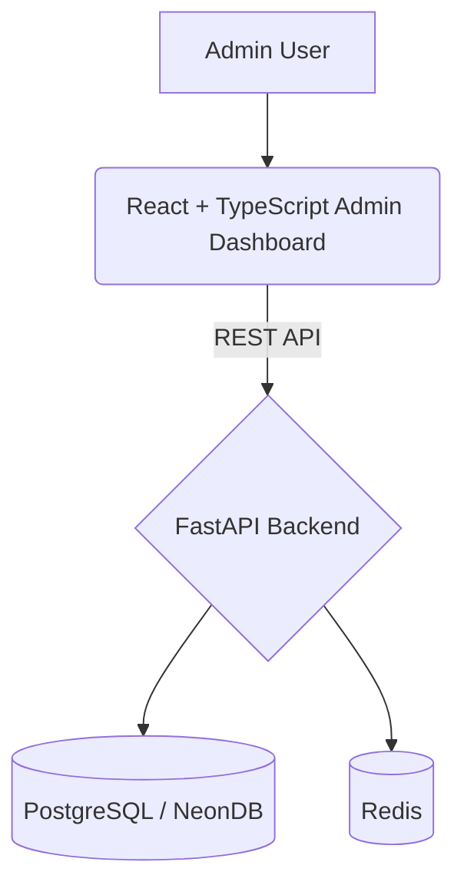

# 🌱 Village API — Rural Data & Administration Platform

<p align="center"><strong>India Village Data API + Admin Dashboard</strong><br>A full-stack platform for accessing, searching, managing, and monitoring village-level location data.</p>

---

## 📌 Project Overview

**Village API** is a full-stack B2B platform providing structured Indian village and administrative-location data through secure REST APIs and an administrator dashboard.

**Hierarchy:** Country → State → District → Sub-district → Village

The platform combines a **FastAPI** backend, **React + TypeScript + Vite** frontend, **PostgreSQL/NeonDB**, **Redis**-supported services, JWT authentication, API-key authentication, Alembic migrations, analytics, and administration tools.

---

## ✨ Key Features

### 🗺️ Location Hierarchy
- **Navigation:** State → District → Sub-district → Village
- **Functionality:** Village search, filtering, and pagination
- **Data:** Village codes and administrative metadata

### 🔎 Quick Search
Search across village name/code, sub-district name/code, district name/code, and state name/code.

### 📊 Admin Dashboard
Monitor and analyze platform metrics:
- Total villages
- Active users
- API requests
- Average response time
- Villages by state
- API request trends & Usage analytics

### 👥 User Management
Administrators can search, filter, view, approve, suspend, activate, and delete users, inspect user-specific API keys and request history, and manage state access.

### 🔑 API Key Management
Create, activate, revoke, and rotate API keys; configure rate limits; view request counts; and associate keys with users.

### 📜 API Logs
View timestamp, API key, method, endpoint, response status, response time, and IP information. Supports search, filtering, pagination, and CSV export.

---

## 🏗️ Architecture



---

## 🛠️ Technology Stack

| Layer | Technologies |
| --- | --- |
| **Frontend** | React, TypeScript, Vite, Tailwind CSS, Recharts, Zustand, TanStack React Query |
| **Backend** | Python, FastAPI, SQLAlchemy, Uvicorn |
| **Database** | PostgreSQL, NeonDB |
| **Migrations** | Alembic |
| **Supporting Services** | Redis |
| **Authentication** | JWT, API Key + API Secret |

---

## 📁 Project Structure

```text
Village_API/
├── README.md
├── .gitignore
├── backend/
│   ├── app/
│   ├── alembic/
│   ├── dataset/
│   ├── scripts/
│   ├── tests/
│   ├── templates/
│   ├── .env.example
│   ├── Dockerfile
│   ├── main.py
│   ├── pyproject.toml
│   └── alembic.ini
└── frontend/
    ├── public/
    ├── src/
    ├── .env.example
    ├── package.json
    ├── tsconfig.json
    └── vite.config.ts
```

---

## 🚀 Getting Started

### Prerequisites
- Python 3.12+ (Using `uv`)
- Node.js and npm
- PostgreSQL / NeonDB
- Redis (where required by backend services)
- Git

### Backend Setup
1. Navigate to the backend directory:
   ```bash
   cd backend
   ```
2. Set up the virtual environment (using `uv` is recommended):
   ```bash
   uv venv
   # Windows:
   .venv\Scripts\activate
   # macOS/Linux:
   source .venv/bin/activate
   ```
3. Install dependencies:
   ```bash
   uv sync
   ```
4. Create `backend/.env` using `backend/.env.example`. Typical configuration:
   ```env
   DATABASE_URL=your_postgresql_connection_string
   SECRET_KEY=your_secret_key
   REDIS_URL=your_redis_connection_string
   ```
5. Run the development server:
   ```bash
   uvicorn main:app --reload --port 8000
   ```
   **Backend:** http://127.0.0.1:8000  
   **Swagger UI:** http://127.0.0.1:8000/docs  
   **ReDoc:** http://127.0.0.1:8000/redoc  

### Frontend Setup
1. Navigate to the frontend directory:
   ```bash
   cd frontend
   ```
2. Install dependencies:
   ```bash
   npm install
   ```
3. Create `frontend/.env` using `frontend/.env.example`:
   ```env
   VITE_API_BASE_URL=http://localhost:8000/api/v1
   VITE_API_KEY=your_demo_api_key
   VITE_API_SECRET=your_demo_api_secret
   VITE_DEMO_EMAIL=demo@example.com
   VITE_DEMO_PASSWORD=your_demo_password
   ```
   *(Note: Do not place master/private production secrets in the frontend. Use dedicated restricted credentials.)*
4. Start the development server:
   ```bash
   npm run dev
   ```

---

## 🔄 Authentication Flow

1. **Email + Password** ➔ `POST /auth/login` ➔ **JWT Access Token**
2. **JWT Access Token** ➔ `GET /auth/me` ➔ **Admin Verification** ➔ **Admin Dashboard**

*API consumers authenticate with `X-API-Key` and `X-API-Secret` according to the configured backend security rules.*

---

## 📚 Main API Areas

- `/auth/login` & `/auth/me`
- `/states`, `/districts`, `/subdistricts`, `/villages`
- `/autocomplete` & `/search`
- `/admin/users`, `/admin/keys`, `/admin/logs`, `/admin/usage`, `/admin/overview`
- `/analytics/summary`, `/analytics/request-trend`, `/analytics/top-states`

*Use `/docs` as the authoritative source for the exact current endpoints, parameters, and schemas.*

---

## 🗄️ Database

Major data areas include: `users`, `api_keys`, `request_logs`, `countries`, `states`, `districts`, `sub_districts`, `villages`, `user_state_access`, `alembic_version`.

The current project dataset contains approximately **564K village records**.

### Migrations
```bash
# Check current migration status
alembic current

# Upgrade to the latest migration
alembic upgrade head

# Generate a new migration (always review before applying)
alembic revision --autogenerate -m "describe change"
```

---

## 🌐 Deployment

**Recommended deployment architecture:**
- **Frontend** → Vercel / Netlify
- **Backend** → Render / Railway
- **Database** → Neon PostgreSQL
- **Redis** → Managed Redis (e.g., Upstash)

**Production Checklist:**
- [ ] Real `.env` files are not committed
- [ ] Production secrets are securely stored in hosting environment variables
- [ ] Dedicated demo/admin account is used
- [ ] Master API secrets are not exposed in frontend code
- [ ] Backend CORS allows only the deployed frontend origin
- [ ] API keys have appropriate rate limits
- [ ] Database migrations are applied

---

## 👥 Team

This project was developed collaboratively.

| Team Member | Primary Responsibility |
| :--- | :--- |
| **Priya Singh** | Backend development, FastAPI, REST APIs, authentication, backend integration |
| **Vinay** | Database & Data engineering, village data preparation/import, PostgreSQL/NeonDB |
| **Darshan B** | Frontend development, React dashboard, UI/UX, frontend-backend integration |

---

## 📈 Future Enhancements

- [ ] Advanced analytics
- [ ] Granular API usage controls
- [ ] Billing/subscription integration
- [ ] More detailed API consumer documentation
- [ ] Caching and query optimization
- [ ] Granular role-based administration
- [ ] Production monitoring and alerting
- [ ] Automated CI/CD pipelines

---

<p align="center"><strong>Village API</strong><br>Rural Data • Secure APIs • Real Impact</p>